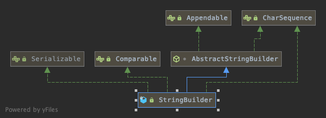

## 建造者模式
### 核心思想
```
Separate the construction of a complex object from itsrepresentation so that the same construction process cancreate different representations.
将一个复杂对象的构建与它的表示分离，使得同样的构建过程可以创建不同的表示。
```
- 建造者模式（Builder Pattern） 又叫生成器模式，是一种对象构建模式。它可以将复杂对象的建造过程抽象出来（抽象类别），使这个抽象过程的不同实现方法可以构造出不同表现（属性）的对象。
- 建造者模式 是一步一步创建一个复杂的对象，它允许用户只通过指定复杂对象的类型和内容就可以构建它们，用户不需要知道内部的具体构建细节。

### 代码解读


- [Product](improve/House.java) 产品类

    一个具体的产品对象。
- [Builder](improve/HouseBuilder.java) 抽象建造者

    创建一个Product对象的各个部件指定的 接口/抽象类。
- [ConcreteBuilder](improve/CommonBuilding.java) 具体建造者

    实现接口，构建和装配各个部件。 
- [Director](improve/HouseDirector.java)  指挥者

    构建一个使用Builder接口的对象。它主要是用于创建一个复杂的对象。它主要有两个作用:
    1. 隔离了客户与对象的生产过程
    2. 负责控制产品对象的生产过程。 

### 建造者模式在 JDK 的应用和源码分析

1. java.lang.StringBuilder中的建造者模式
2. 代码说明
```java
public final class StringBuilder extends AbstractStringBuilder implements java.io.Serializable, CharSequence {
    @Override
    public StringBuilder append(String str) {
        super.append(str);
        return this;
    }
}
abstract class AbstractStringBuilder implements Appendable, CharSequence {
    char[] value;
    int count;
    public AbstractStringBuilder append(String str) {
        if (str == null)
            return appendNull();
        int len = str.length();
        ensureCapacityInternal(count + len);
        str.getChars(0, len, value, count);
        count += len;
        return this;
    }
}
```
### 源码中建造者模式角色分析
- Appendable 接口定义了多个 append 方法(抽象方法), 即 Appendable 为抽象建造者, 定义了抽象方法
- AbstractStringBuilder 实现了 Appendable 接口方法，这里的 AbstractStringBuilder 已经是建造者，只是不能实例化
- StringBuilder 即充当了指挥者角色，同时充当了具体的建造者，建造方法的实现是由 AbstractStringBuilder 完成, 而 StringBuilder 继承了 AbstractStringBuilder

### 建造者模式的注意事项和细节
- 客户端(使用程序)不必知道产品内部组成的细节，将产品本身与产品的创建过程解耦，使得相同的创建过程可以创建不同的产品对象
- 每一个具体建造者都相对独立，而与其他的具体建造者无关，因此可以很方便地替换具体建造者或增加新的具体建造者， 用户使用不同的具体建造者即可得到不同的产品对象
- 可以更加精细地控制产品的创建过程 。将复杂产品的创建步骤分解在不同的方法中，使得创建过程更加清晰，也更方便使用程序来控制创建过程
- 增加新的具体建造者无须修改原有类库的代码，指挥者类针对抽象建造者类编程，系统扩展方便，符合 “开闭原则”