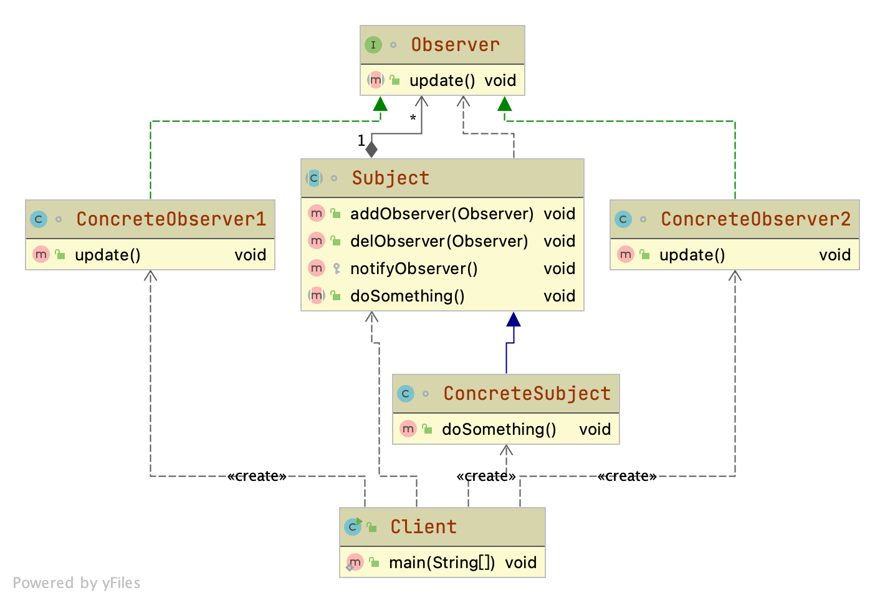

## [观察者模式](https://juejin.cn/post/6844904100459446285)

### 核心思想

```
定义对象间的一种一对多的依赖关系，当一个对象的状态发生改变时，所有依赖于它的对象都得到通知并被自动更新。
```


- [Subject](Subject.java)（目标）：被观察者，它是指被观察的对象。 从类图中可以看到，类中有一个用来存放观察者对象的Vector
  容器（之所以使用Vector而不使用List，是因为多线程操作时，Vector在是安全的，而List则是不安全的），这个Vector容器是被观察者类的核心，另外还有三个方法：attach方法是向这个容器中添加观察者对象；detach方法是从容器中移除观察者对象；notify方法是依次调用观察者对象的对应方法。这个角色可以是接口，也可以是抽象类或者具体的类，因为很多情况下会与其他的模式混用，所以使用抽象类的情况比较多。

- ConcreteSubject（具体目标）：具体目标是目标类的子类，通常它包含经常发生改变的数据，当它的状态发生改变时，向它的各个观察者发出通知。同时它还实现了在目标类中定义的抽象业务逻辑方法（如果有的话）。如果无须扩展目标类，则具体目标类可以省略。

- [Observer](Observer.java)（观察者）：观察者将对观察目标的改变做出反应，观察者一般定义为接口，该接口声明了更新数据的方法 update()，因此又称为抽象观察者。

- ConcreteObserver（具体观察者）：在具体观察者中维护一个指向具体目标对象的引用，它存储具体观察者的有关状态，这些状态需要和具体目标的状态保持一致；它实现了在抽象观察者 Observer 中定义的 update()
  方法。通常在实现时，可以调用具体目标类的 attach() 方法将自己添加到目标类的集合中或通过 detach() 方法将自己从目标类的集合中删除。


### 优缺点

| 优点 | 缺点 |
| --- | --- |
| 降低了目标与观察者之间的耦合关系，两者之间是抽象耦合关系 | 目标与观察者之间的依赖关系并没有完全解除，而且有可能出现循环引用 |
| 目标与观察者之间建立了一套触发机制                   |   当观察者对象很多时，通知的发布会花费很多时间，影响程序的效率 |
| 支持广播通信 | |
| 符合“开闭原则”的要求 |  |

### JDK中的观察者模式
观察者模式在 Java 语言中的地位非常重要。在 JDK 的 java.util 包中，提供了 Observable 类以及 Observer 接口，它们构成了 JDK 对观察者模式的支持（可以去查看下源码，写的比较严谨）。but，在 Java9 被弃用了。
### Spring 中的观察者模式
Spring 事件驱动模型也是观察者模式很经典的应用。就是我们常见的项目中最常见的事件监听器。
1. Spring 中观察者模式的四个角色
    - 事件：ApplicationEvent 是所有事件对象的父类。ApplicationEvent 继承自 jdk 的 EventObject, 所有的事件都需要继承 ApplicationEvent, 并且通过 source 得到事件源。
    Spring 也为我们提供了很多内置事件，ContextRefreshedEvent、ContextStartedEvent、ContextStoppedEvent、ContextClosedEvent、RequestHandledEvent。
    - 事件监听：ApplicationListener，也就是观察者，继承自 jdk 的 EventListener，该类中只有一个方法 onApplicationEvent。当监听的事件发生后该方法会被执行。
    - 事件源：ApplicationContext，ApplicationContext 是 Spring 中的核心容器，在事件监听中 ApplicationContext 可以作为事件的发布者，也就是事件源。因为 ApplicationContext 继承自 ApplicationEventPublisher。在 ApplicationEventPublisher 中定义了事件发布的方法：publishEvent(Object event)
    - 事件管理：ApplicationEventMulticaster，用于事件监听器的注册和事件的广播。监听器的注册就是通过它来实现的，它的作用是把 Applicationcontext 发布的 Event 广播给它的监听器列表。

2. 代码实现
    ```java
      public class MyEvent extends ApplicationEvent {
          public MyEvent(Object source) {
              super(source);
              System.out.println("my Event");
          }
      }
  
  
      @Component
      class MyListenerA implements ApplicationListener<MyEvent> {
          public void onApplicationEvent(MyEvent AyEvent) {
              System.out.println("ListenerA received");
          }
      }
      @Component
      class MyListenerB implements ApplicationListener<MyEvent> {
          public void onApplicationEvent(MyEvent AyEvent) {
              System.out.println("ListenerB received");
          }
      }
  
  
      @Component
      public class MyPublisher implements ApplicationContextAware {
          private ApplicationContext applicationContext;
          
          public void setApplicationContext(ApplicationContext applicationContext) throws BeansException {
              this.applicationContext=applicationContext;
          }
          
          public void publishEvent(ApplicationEvent event){
              System.out.println("publish event");
              applicationContext.publishEvent(event);
          }
      }
  
  
      @Configuration
      @ComponentScan
      public class AppConfig {
  
          @Bean(name = "myPublisher")
          public MyPublisher myPublisher(){
              return new MyPublisher();
          }
      }
  
  
      public class Client {
  
          @Test
          public void main() {
              ApplicationContext context = new AnnotationConfigApplicationContext(AppConfig.class);
              MyPublisher myPublisher = (MyPublisher) context.getBean("myPublisher");
              myPublisher.publishEvent(new MyEvent(this));
          }
      }
    ```