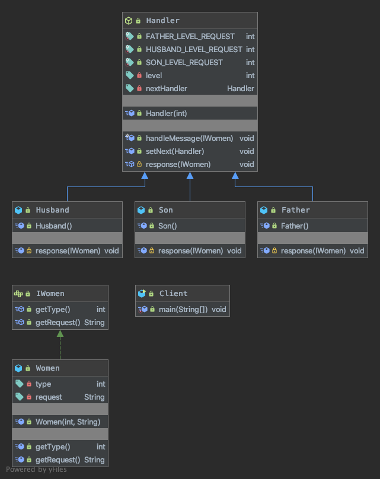

## 责任链模式
### 核心思想
```
Avoid coupling the sender of a request to its receiver bygiving more than one object a chance to handle therequest.Chain the receiving objects and pass the requestalong the chain until an object handles it.
使多个对象都有机会处理请求，从而避免了请求的发送者和接受者之间的耦合关系。将这些对象连成一条链，并沿着这条链传递该请求，直到有对象处理它为止。
```
- 责任链模式的核心是在“链”上，由一条链去处理相似的请求在链中决定谁来处理这个请求，并返回相应的结果
- 责任链模式屏蔽了请求的处理过程，你发起一个请求到底是谁处理的，这个你不用关心，只要你把请求抛给责任链的第一个处理者，最终会返回一个处理结果（当然也可以不做任何处理），作为请求者可以不用知道到底是需要谁来处理的，这是责任链模式的核心，同时责任链模式也可以作为一种补救模式来使用。

### 代码解读


Handler 抽象类的三个职责:
1. 自己的处理级别 level 
2. 定义处理方法 handleMessage
3. 设置下一个处理着 setNext

### 优缺点
<table>
    <tr>
        <td>优点</td> 
        <td>缺点</td> 
        <td>注意事项</td>
    </tr>
    <tr>
        <td>责任链模式非常显著的优点是将请求和处理分开。请求者可以不用知道是谁处理的，处理者可以不用知道请求的全貌（例如在J2EE项目开发中，可以剥离出无状态Bean由责任链处理），两者解耦，提高系统的灵活性。</td>
        <td>责任链有两个非常显著的缺点：一是性能问题，每个请求都是从链头遍历到链尾，特别是在链比较长的时候，性能是一个非常大的问题。二是调试不很方便，特别是链条比较长，环节比较多的时候，由于采用了类似递归的方式，调试的时候逻辑可能比较复杂。</td>
        <td>链中节点数量需要控制，避免出现超长链的情况，一般的做法是在Handler中设置一个最大节点数量，在setNext方法中判断是否已经是超过其阈值，超过则不允许该链建立，避免无意识地破坏系统性能。</td> 
    </tr>
</table>
