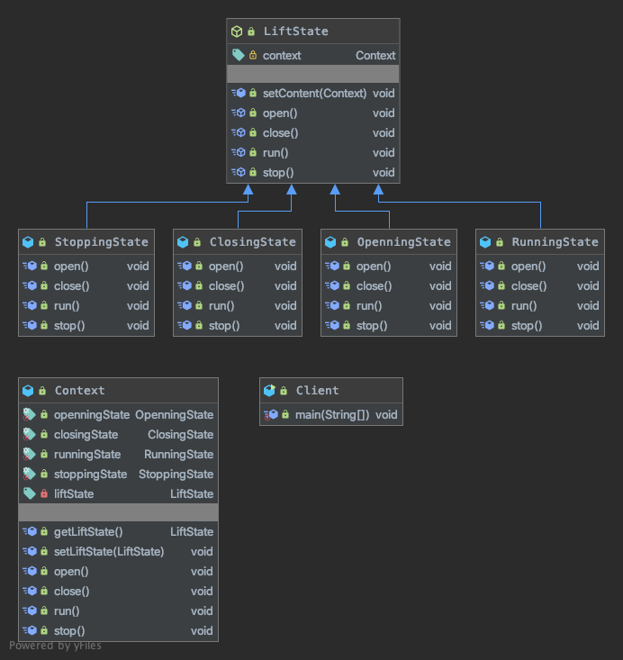

## 状态模式


### 核心思想
```
Allow an object to alter its behavior when its internal statechanges.The object will appear to change its class.
当一个对象内在状态改变时允许其改变行为，这个对象看起来像改变了其类。
```
状态模式的核心是封装，状态的变更引起了行为的变更，从外部看起来就好像这个对象对应的类发生了改变一样。

### 代码解读


状态模式中的3个角色:
-  LiftState - 抽象状态角色
    
    接口或抽象类，负责对象状态定义，并且封装环境角色以实现状态切换。
- OpenningState - 具体状态角色
    
    每一个具体状态必须完成两个职责：本状态的行为管理以及趋向状态处理，通俗地说，就是本状态下要做的事情，以及本状态如何过渡到其他状态。
    
- Context - 环境角色

    定义客户端需要的接口，并且负责具体状态的切换。
    
Context是一个环境角色，它的作用是串联各个状态的过渡，在LiftSate抽象类中我们定义并把这个环境角色聚合进来，并传递到子类，也就是4个具体的实现类中自己根据环境来决定如何进行状态的过渡。

### 优缺点
|优点| |缺点|
|:----:|:----:|:----:|
|结构清晰|避免了过多的switch...case或者if...else语句的使用，避免了程序的复杂性,提高系统的可维护性。|类会太多，也就是类膨胀。如果一个事物有很多个状态也不稀奇，如果完全使用状态模式就会有太多的子类，不好管理||
|遵循设计原则|很好地体现了开闭原则和单一职责原则，每个状态都是一个子类，你要增加状态就要增加子类，你要修改状态，你只修改一个子类就可以了。|||
|封装性非常好|这也是状态模式的基本要求，状态变换放置到类的内部来实现，外部的调用不用知道类内部如何实现状态和行为的变换|||

### 使用场景

- 行为随状态改变而改变的场景

    这也是状态模式的根本出发点，例如权限设计，人员的状态不同即使执行相同的行为结果也会不同，在这种情况下需要考虑使用状态模式。
- 条件、分支判断语句的替代者

    在程序中大量使用switch语句或者if判断语句会导致程序结构不清晰，逻辑混乱，使用状态模式可以很好地避免这一问题，它通过扩展子类实现了条件的判断处理。