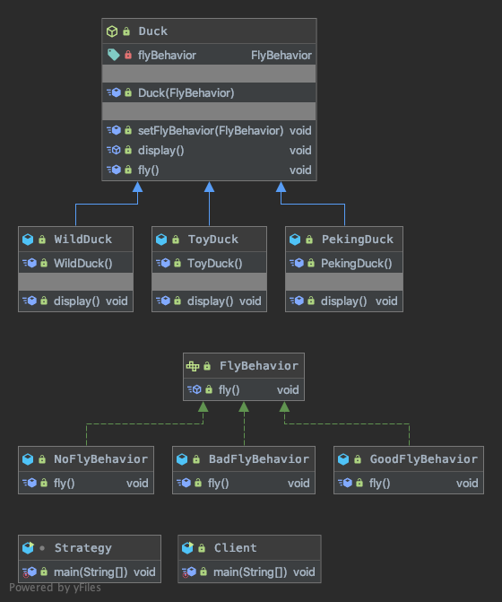

## 策略模式
### 核心思想
```
Define a family of algorithms,encapsulate eachone,and make them interchangeable.
定义一组算法，将每个算法都封装起来，并且使它们之间可以互换。
```
1. 策略模式（Strategy Pattern）中，定义算法族，分别封装起来，让他们之间可以互相替换，此模式让算法的变化独立于使用算法的客户
2. 这算法体现了几个设计原则，
    1. 把变化的代码从不变的代码中分离出来；
    2. 针对接口编程而不是具体类（定义了策略接口）；
    3. 多用组合/聚合，少用继承（客户通过组合方式使用策略）。

### 代码解读


### 策略模式在JDK-Arrays 应用的源码分析
1. JDK的 Arrays 的Comparator就使用了策略模式
2. 代码分析
```java
class Strategy {
    public static void main(String[] args) {
        Integer[] array = {100, 20, 13, 40, 15};
        /**
         * 给数组排序, 实现策略接口 Comparator
         * 实现升序排列: 返回 -1 放左边, 1 放右边, 0 保持不变
         */
        Comparator<Integer> comparator = (t1, t2) -> t1 > t2 ? 1 : -1;
        Arrays.sort(array, comparator);
        System.out.println(Arrays.toString(array));
    }
}
```

### 策略模式的注意事项和细节
- 策略模式的关键是：分析项目中变化部分与不变部分
- 策略模式的核心思想是：多用组合/聚合 少用继承；用行为类组合，而不是行为的继承。更有弹性
- 体现了“对修改关闭，对扩展开放”原则，客户端增加行为不用修改原有代码，只要添加一种策略（或者行为）即可，避免了使用多重转移语句（if..else if..else）
- 提供了可以替换继承关系的办法： 策略模式将算法封装在独立的Strategy类中使得你可以独立于其Context改变它，使它易于切换、易于理解、易于扩展
- 需要注意的是：每添加一个策略就要增加一个类，当策略过多是会导致类数目庞大