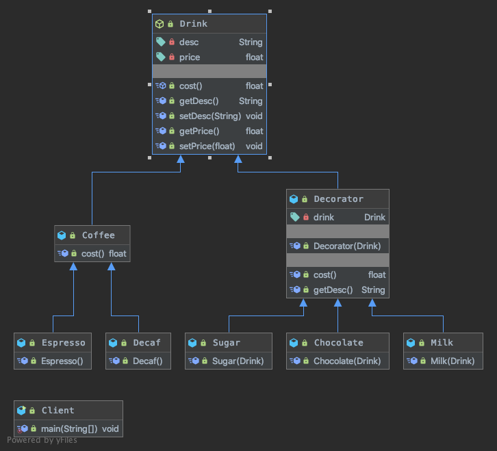
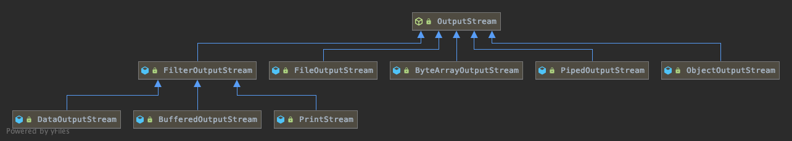

## 装饰者模式
### 核心思想
```
Attach additionalresponsibilities to an object dynamicallykeeping the same interface.Decorators providea flexible alternative to subclassing forextending functionality.
动态地给一个对象添加一些额外的职责。就增加功能来说，装饰模式相比生成子类更为灵活。
```
- 装饰者模式：动态的将新功能附加到对象上。在对象功能扩展方面，它比继承更有弹性，装饰者模式也体现了开闭原则(ocp)

### 代码解读


- [Drink](Drink.java) 抽象类
- [Decaf](Decaf.java) 无因咖啡 - 被装饰者
- [Decorator](Decorator.java) 是一个装饰类，含有一个被装饰的对象(Drink drink)
- [Decorator](Decorator.java) 的cost 方法 进行一个费用的叠加计算，递归的计算价格
- [Milk](Milk.java) 牛奶 - 装饰品

### 在 JDK 应用的源码分析

Java的IO结构，FilterInputStream就是一个装饰者
