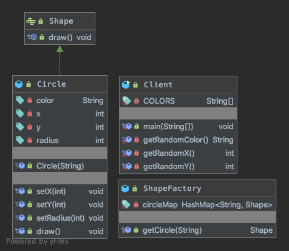

## 享元模式
### 核心思想
```
Use sharing to supportlarge numbers of fine-grained objectsefficiently.
使用共享对象可有效地支持大量的细粒度的对象。
```
- 享元模式（Flyweight Pattern） 也叫 蝇量模式: 运用共享技术有效地支持大量细粒度的对象
- 常用于系统底层开发，解决系统的性能问题。像数据库连接池，里面都是创建好的连接对象，在这些连接对象中有我们需要的则直接拿来用，避免重新创建，如果没有我们需要的，则创建一个
- 享元模式能够解决重复对象的内存浪费的问题，当系统中有大量相似对象，需要缓冲池时。不需总是创建新对象，可以从缓冲池里拿。这样可以降低系统内存，同时提高效率
- 享元模式经典的应用场景就是池技术了，String常量池、数据库连接池、缓冲池等等都是享元模式的应用，享元模式是池技术的重要实现方式

### 代码解读


[ShapeFactory](ShapeFactory.java) 有一个 [Circle](Circle.java) 的 HashMap，其中键名为 [Circle](Circle.java) 对象的颜色。无论何时接收到请求，都会创建一个特定颜色的圆。[ShapeFactory](ShapeFactory.java) 检查它的 HashMap 中的 circle 对象，如果找到 [Circle](Circle.java) 对象，则返回该对象，否则将创建一个存储在 hashmap 中以备后续使用的新对象，并把该对象返回到客户端。[Client](Client.java) 类使用 [ShapeFactory](ShapeFactory.java) 来获取 [Shape](Shape.java) 对象。它将向 [ShapeFactory](ShapeFactory.java) 传递信息（red / green / blue/ black / white），以便获取它所需对象的颜色。

### 在 JDK 应用的源码分析

```java
class FlyWeight {

    public static void main(String[] args) {
        Integer x = Integer.valueOf(127);
        Integer y = new Integer(127);
        Integer z = Integer.valueOf(127);
        Integer w = new Integer(127);
        System.out.println(x.equals(y));
        System.out.println(x == y);
        System.out.println(x == z);
        System.out.println(x == w);
        System.out.println(y == w);
//        true
//        false
//        true
//        false
//        false
    }
}
public final class Integer extends Number implements Comparable<Integer> {
    
    public static Integer valueOf(int i) {
        if (i >= IntegerCache.low && i <= IntegerCache.high)
            return IntegerCache.cache[i + (-IntegerCache.low)];
        return new Integer(i);
    }

    public Integer(int value) {
        this.value = value;
    }
}
```

### 这里提供一个稍微精细一点的代码示例，演示如何使用享元模式绘制大量的圆形。代码注释中也有详细的解释：
```java
import java.awt.Color;
import java.awt.Graphics;
import java.util.HashMap;
import java.util.Map;
import javax.swing.JFrame;
import javax.swing.JPanel;

// 抽象享元类，定义绘制方法
interface Shape {
    void draw(Graphics g, int x, int y);
}

// 具体享元类，实现Shape接口，表示圆形
class Circle implements Shape {
    private int radius;

    public Circle(int radius) {
        this.radius = radius;
        System.out.println("创建圆形，半径：" + radius);
    }

    public void draw(Graphics g, int x, int y) {
        g.setColor(Color.RED);
        g.drawOval(x, y, radius * 2, radius * 2);
    }
}

// 享元工厂类，用于创建和管理共享的享元对象
class ShapeFactory {
    private static final Map<Integer, Shape> circleMap = new HashMap<>();

    // 获取圆形对象，如果已经存在相应的对象，则返回该对象，否则创建新的对象并添加到Map中
    public static Shape getCircle(int radius) {
        Shape circle = circleMap.get(radius);
        if (circle == null) {
            circle = new Circle(radius);
            circleMap.put(radius, circle);
        }
        return circle;
    }
}

// 界面类，用于绘制圆形
class DrawingPanel extends JPanel {
    private static final int MAX_RADIUS = 50;
    private static final int MAX_X = 500;
    private static final int MAX_Y = 500;
    private static final int COUNT = 100;

    @Override
    public void paintComponent(Graphics g) {
        super.paintComponent(g);

        // 随机绘制100个圆形
        for (int i = 0; i < COUNT; i++) {
            // 随机生成圆形的半径和坐标
            int radius = (int) (Math.random() * MAX_RADIUS);
            int x = (int) (Math.random() * (MAX_X - radius * 2));
            int y = (int) (Math.random() * (MAX_Y - radius * 2));

            // 获取圆形对象并绘制
            Shape circle = ShapeFactory.getCircle(radius);
            circle.draw(g, x, y);
        }
    }
}

// 主程序类，显示界面并启动绘制任务
public class Client {
    public static void main(String[] args) {
        JFrame frame = new JFrame("享元模式示例");
        frame.setSize(500, 500);
        frame.setDefaultCloseOperation(JFrame.EXIT_ON_CLOSE);

        JPanel panel = new DrawingPanel();
        frame.add(panel);

        frame.setVisible(true);
    }
}
```

### 注意事项和细节
1. 在享元模式这样理解，“享”就表示共享，“元”表示对象
2. 系统中有大量对象，这些对象消耗大量内存，并且对象的状态大部分可以外部化时，我们就可以考虑选用享元模式
3. 用唯一标识码判断，如果在内存中有，则返回这个唯一标识码所标识的对象，用HashMap/HashTable存储
4. 享元模式大大减少了对象的创建，降低了程序内存的占用，提高效率
5. 享元模式提高了系统的复杂度。需要分离出内部状态和外部状态，而外部状态具有固化特性，不应该随着内部状态的改变而改变，这是我们使用享元模式需要注意的地方.
6. 使用享元模式时，注意划分内部状态和外部状态，并且需要有一个工厂类加以控制。
7. 享元模式经典的应用场景是需要缓冲池的场景，比如 String常量池、数据库连接池