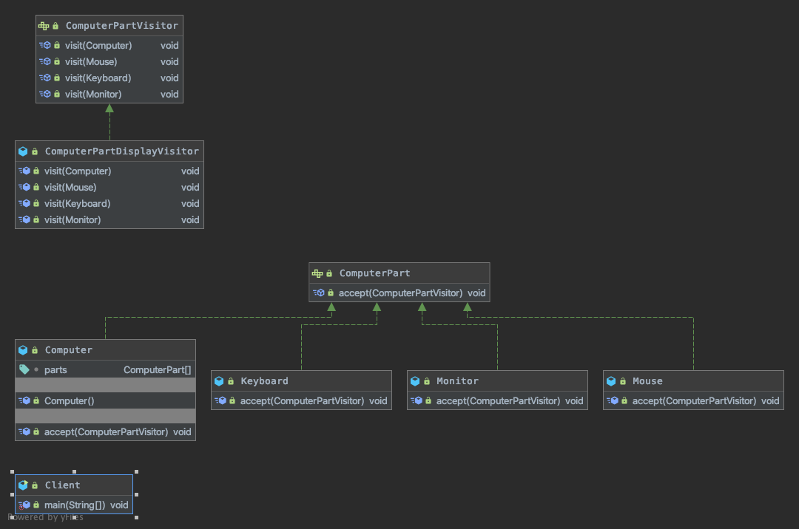

## 访问者模式
### 核心思想
```
Represent an operation tobe performed on the elements of an objectstructure.Visitor lets you define a newoperation without changing the classes of theelements on which it operates.
封装一些作用于某种数据结构中的各元素的操作，它可以在不改变数据结构的前提下定义作用于这些元素的新的操作。
```

### 代码解读


- [ComputerPartVisitor](ComputerPartVisitor.java) 抽象访问者
    
    抽象类或者接口，声明访问者可以访问哪些元素，具体到程序中就是 visit 方法的参数定义哪些对象是可以被访问的。
- [ComputerPartDisplayVisitor](ComputerPartDisplayVisitor.java) 具体访问者
    
    定义访问者访问到一个类后该怎么干，要做什么事情。
- [ComputerPart](ComputerPart.java) 抽象元素    
    
    接口或者抽象类，声明接受哪一类访问者访问，程序上是通过 accept 方法中的参数来定义的。
- [Monitor](Monitor.java) 具体元素
    
    实现accept方法，通常是 visitor.visit(this)，基本上都形成了一种模式了。
    
### 优缺点
<table>
    <tr>
        <td>优点</td> 
        <td></td>
        <td>缺点</td> 
        <td></td>
    </tr>
    <tr>
        <td>符合单一职责原则</td>
        <td>具体元素角色负责数据的加载，而具体访问者负责包装展现，两个不同的职责非常明确地分离开来，各自演绎变化。</td>
        <td>具体元素对访问者公布细节</td> 
        <td>访问者要访问一个类就必然要求这个类公布一些方法和数据，也就是说访问者关注了其他类的内部细节，这是迪米特法则所不建议的。</td>
    </tr>
    <tr>
        <td>优秀的扩展性</td>
        <td>由于职责分开，继续增加对数据的操作是非常快捷的。</td>
        <td>具体元素变更比较困难</td>
        <td>具体元素角色的增加、删除、修改都是比较困难的</td>
    </tr>
    <tr>
        <td>灵活性非常高</td>
        <td>将同样角色的不同元素分开管理避免了多余的判断，并且可以增加访问者对元素做不同的包装。</td>
        <td>违背了依赖倒置转原则</td>
        <td>访问者依赖的是具体元素，而不是抽象元素，这破坏了依赖倒置原则，特别是在面向对象的编程中，抛弃了对接口的依赖，而直接依赖实现类，扩展比较难。</td>
    </tr>
</table>
